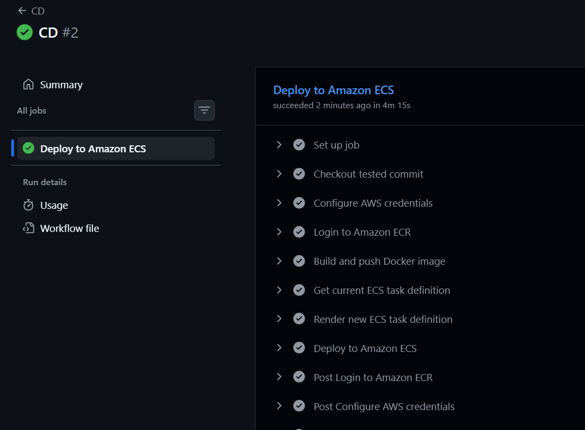
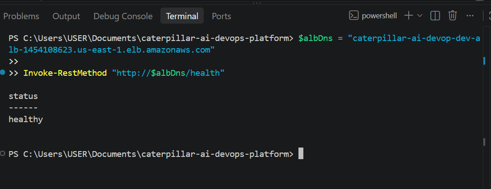
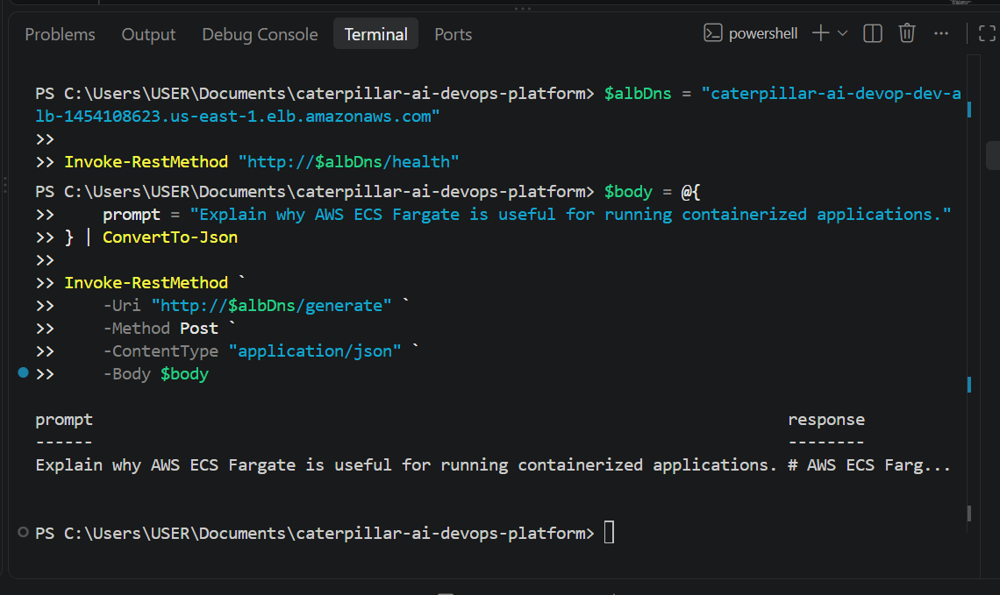
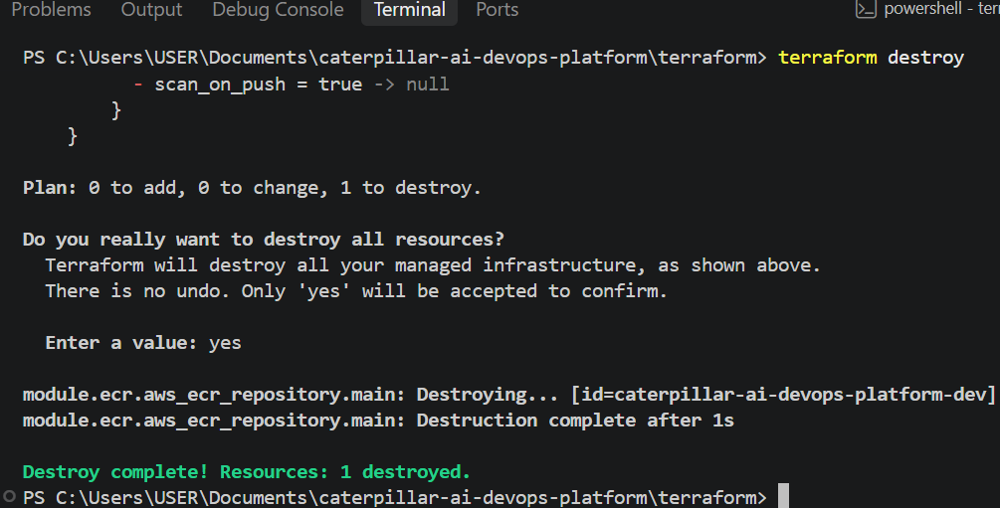
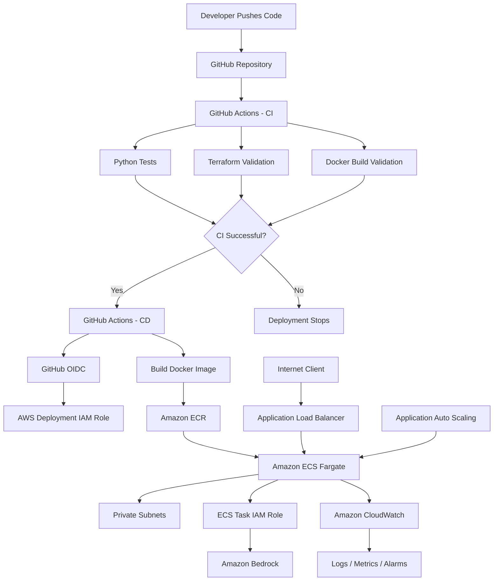

# Enterprise AI Platform

[](https://github.com/davidikundji/Enterprise-AI-Platform/actions/workflows/ci.yml)
[](https://github.com/davidikundji/Enterprise-AI-Platform/actions/workflows/cd.yml)


A production-style AWS AI/DevOps platform that deploys a containerized FastAPI application integrated with Amazon Bedrock using Terraform, Docker, Amazon ECS Fargate, Amazon ECR, GitHub Actions, IAM/OIDC, Application Load Balancing, Auto Scaling, and CloudWatch.

The project demonstrates how to build, secure, deploy, monitor, and continuously deliver an AI-enabled application on AWS without storing long-lived AWS credentials in GitHub.

---

## Project Overview

The application exposes a FastAPI API with:

- `GET /health` — application health check
- `POST /generate` — sends a prompt to Amazon Bedrock and returns an AI-generated response

The infrastructure is fully defined with Terraform and was deployed across multiple Availability Zones. ECS Fargate tasks ran in private subnets behind a public Application Load Balancer.

The CI/CD pipeline was implemented with GitHub Actions. CI validates the application, Terraform, and Docker build. CD runs only after CI succeeds on `main`, authenticates to AWS through GitHub OIDC, builds an immutable Docker image tagged with the Git commit SHA, pushes it to ECR, registers a new ECS task-definition revision, and updates the ECS service.

> **Cost note:** The AWS infrastructure used for project validation was destroyed after testing to prevent ongoing cloud charges. The source code and Terraform configuration remain in the repository so the environment can be recreated when needed.

---

## Project Evidence

The following screenshots capture key milestones from the completed deployment and validation.

### Successful GitHub Actions CD Deployment

The CD workflow authenticated to AWS using OIDC, logged in to Amazon ECR, built and pushed the Docker image, retrieved and rendered the ECS task definition, and deployed the new revision successfully.



### Live Application Health Check

After deployment, the application was tested through the public Application Load Balancer. The `/health` endpoint returned `healthy`, confirming that the ECS service and load-balancer health checks were working.



### Amazon Bedrock Integration Test

A live request was sent to the `/generate` endpoint through the Application Load Balancer. The FastAPI service running on ECS successfully invoked Amazon Bedrock and returned an AI-generated response.



### Infrastructure Cleanup

After validation, the AWS infrastructure was destroyed to prevent unnecessary ongoing cloud costs. Terraform completed the final cleanup successfully.



---

## Architecture



---

## AWS Architecture

The AWS environment included:

- A custom VPC spanning two Availability Zones
- Two public subnets for internet-facing infrastructure
- Two private subnets for ECS workloads
- Internet Gateway
- NAT Gateway
- Application Load Balancer
- Security groups using least-privilege traffic rules
- Amazon ECS cluster using AWS Fargate
- Amazon ECR private repository
- ECS service with multiple running tasks
- Application Auto Scaling
- Amazon CloudWatch log groups and alarms
- IAM execution, task, and deployment roles
- GitHub Actions OIDC identity provider
- Amazon Bedrock integration

The ECS tasks were not assigned public IP addresses. External requests entered through the Application Load Balancer, while the application workloads remained in private subnets.

---

## Technology Stack

| Area | Technologies |
|---|---|
| Application | Python, FastAPI, Uvicorn |
| AI | Amazon Bedrock |
| Containers | Docker |
| Container Registry | Amazon ECR |
| Container Orchestration | Amazon ECS Fargate |
| Infrastructure as Code | Terraform |
| Networking | VPC, Public/Private Subnets, NAT Gateway, Internet Gateway |
| Load Balancing | Application Load Balancer |
| Auto Scaling | ECS Application Auto Scaling |
| CI/CD | GitHub Actions |
| Authentication | GitHub OIDC + AWS IAM |
| Monitoring | Amazon CloudWatch |
| Testing | Pytest |
| Version Control | Git, GitHub |

---

## Terraform Module Structure

```text
terraform/
├── main.tf
├── providers.tf
├── variables.tf
├── versions.tf
└── modules/
    ├── network/
    ├── security/
    ├── ecr/
    ├── iam/
    ├── alb/
    ├── ecs/
    ├── autoscaling/
    ├── monitoring/
    └── github_oidc/
```

This modular design separates networking, security, compute, deployment, monitoring, and identity responsibilities.

---

## Application Structure

```text
.
├── app/
│   ├── main.py
│   ├── bedrock_client.py
│   ├── requirements.txt
│   └── tests/
│       └── test_app.py
├── terraform/
├── .github/
│   └── workflows/
│       ├── ci.yml
│       └── cd.yml
├── Dockerfile
├── .dockerignore
├── .gitignore
└── README.md
```

---

## CI Pipeline

The CI workflow runs on pushes and pull requests to `main`.

It performs:

```text
Checkout source code
        ↓
Install Python dependencies
        ↓
Run Pytest
        ↓
Terraform format check
        ↓
Terraform initialization
        ↓
Terraform validation
        ↓
Docker build validation
```

A failed CI stage prevents deployment.

---

## CD Pipeline

The CD workflow runs only after the CI workflow completes successfully from a push to `main`.

```text
CI Success
    ↓
Checkout exact tested commit SHA
    ↓
Authenticate to AWS using GitHub OIDC
    ↓
Login to Amazon ECR
    ↓
Build Docker image
    ↓
Tag image with Git commit SHA
    ↓
Push image to ECR
    ↓
Retrieve current ECS task definition
    ↓
Render new task definition
    ↓
Register new task-definition revision
    ↓
Update ECS service
    ↓
Wait for service stability
```

Using the Git commit SHA as the container image tag provides traceability between:

```text
Git Commit → CI Run → ECR Image → ECS Task Definition → ECS Deployment
```

---

## GitHub OIDC Authentication

The deployment pipeline does not use long-lived AWS access keys.

GitHub Actions authenticates to AWS using OpenID Connect.

```text
GitHub Actions
      ↓
OIDC Token
      ↓
AWS IAM Trust Policy
      ↓
Temporary AWS Credentials
      ↓
Deployment Role
```

The trust policy is restricted to the approved GitHub repository and `main` branch.

This reduces credential exposure and removes the need to store `AWS_ACCESS_KEY_ID` or `AWS_SECRET_ACCESS_KEY` as GitHub secrets.

---

## IAM Separation of Duties

The project uses separate IAM roles for separate responsibilities.

### GitHub Actions Deployment Role

Used only by the CI/CD deployment workflow.

Permissions are restricted to required deployment operations such as:

- ECR authentication and image push
- ECS service inspection and update
- ECS task-definition registration
- ECS task-definition tagging
- Passing only the approved ECS roles

### ECS Task Execution Role

Used by ECS for platform-level actions such as pulling images and writing logs.

### ECS Application Task Role

Used by the application at runtime to call Amazon Bedrock.

This prevents deployment permissions and application runtime permissions from being combined into one broad role.

---

## Container Security

The Docker container:

- Uses a lightweight Python base image
- Runs the application as a non-root user
- Does not contain AWS access keys
- Receives AWS permissions dynamically through the ECS task role
- Is stored in a private ECR repository

The ECR repository was configured with immutable image tags and image scanning on push.

---

## Networking and Security

```text
Internet
   ↓
Public Application Load Balancer
   ↓
ALB Security Group
   ↓
ECS Security Group
   ↓
ECS Fargate Tasks
   ↓
Private Subnets
```

The ECS security group accepts application traffic only from the ALB security group.

The Fargate tasks were not directly exposed to the internet.

---

## Auto Scaling

ECS Application Auto Scaling was configured to maintain application availability and respond to workload changes.

```text
Minimum tasks: 2
Maximum tasks: 4
CPU target: 60%
Memory target: 70%
```

---

## Monitoring and Observability

Amazon CloudWatch was used for operational visibility.

Monitoring included:

- ECS CPU utilization
- ECS memory utilization
- Application logs
- ALB unhealthy target count
- Target HTTP 5XX errors
- ECS service health

CloudWatch Logs collected output from both running ECS tasks.

---

## Amazon Bedrock Integration

Request flow:

```text
Client
   ↓
Application Load Balancer
   ↓
FastAPI /generate
   ↓
ECS Fargate
   ↓
ECS Task IAM Role
   ↓
Amazon Bedrock
   ↓
AI Response
```

Example request:

```powershell
$body = @{
    prompt = "Explain why AWS ECS Fargate is useful for running containerized applications."
} | ConvertTo-Json

Invoke-RestMethod `
    -Uri "http://<ALB-DNS-NAME>/generate" `
    -Method Post `
    -ContentType "application/json" `
    -Body $body
```

---

## Health Check

The application exposes:

```text
GET /health
```

Example:

```powershell
Invoke-RestMethod "http://<ALB-DNS-NAME>/health"
```

Expected response:

```text
status
------
healthy
```

---

## Troubleshooting Example

During the first automated CD deployment, the pipeline successfully:

- Authenticated to AWS through OIDC
- Logged in to Amazon ECR
- Built the Docker image
- Pushed the image to ECR

The deployment then failed while registering the new ECS task definition because the GitHub Actions deployment role was missing:

```text
ecs:TagResource
```

Instead of granting broad administrator access, the IAM policy was updated through Terraform to add only the missing permission.

The Terraform plan showed:

```text
Plan: 0 to add, 1 to change, 0 to destroy.
```

After applying the least-privilege IAM change and pushing the update:

```text
CI → Passed
CD → Passed
ECS Deployment → Successful
```

The deployment was then validated through both the `/health` endpoint and a live `/generate` request to Amazon Bedrock.

---

## Deployment Validation

### ECS

```text
Desired tasks: 2
Running tasks: 2
Pending tasks: 0
```

### Load Balancer

Both ECS targets reported healthy status.

### Application

```text
GET /health → healthy
```

### AI Integration

```text
POST /generate → Successful Amazon Bedrock response
```

### Logging

CloudWatch showed healthy application traffic and successful ALB health checks.

---

## Infrastructure Cleanup

After completing deployment and validation, the AWS environment was destroyed to prevent unnecessary cloud costs.

```powershell
terraform destroy
```

Post-destroy verification confirmed no remaining project resources in:

```text
NAT Gateways
Application Load Balancers
ECS Clusters
ECR Repositories
Elastic IPs
EC2 Instances
RDS Instances
Unattached EBS Volumes
```

Terraform state was also empty after cleanup.

```text
BUILD → TEST → DEPLOY → VALIDATE → DESTROY
```

---

## Key DevOps Concepts Demonstrated

- Infrastructure as Code
- Modular Terraform architecture
- Docker containerization
- ECS Fargate orchestration
- Immutable container images
- Continuous Integration
- Continuous Deployment
- GitHub Actions
- Passwordless AWS authentication with OIDC
- Least-privilege IAM
- Separation of duties
- High availability
- Application Load Balancing
- Auto Scaling
- Private-subnet workloads
- CloudWatch monitoring and logging
- Generative AI integration with Amazon Bedrock
- Deployment troubleshooting
- Infrastructure lifecycle management

---

## Production Improvements

Future improvements could include:

- S3 remote Terraform state with state locking
- HTTPS using AWS Certificate Manager
- Route 53 DNS
- AWS WAF
- Blue/green or canary deployments
- ECS deployment circuit breakers
- Separate dev, staging, and production environments
- GitHub Environment approval gates
- Container vulnerability gates in CI/CD
- Dependency and source-code security scanning
- Distributed tracing
- Application-level custom metrics
- AWS Secrets Manager or Systems Manager Parameter Store
- Additional disaster recovery controls

---

## Project Outcome

The project demonstrated an end-to-end DevOps workflow:

```text
Developer Push
      ↓
GitHub Actions CI
      ↓
Automated Testing
      ↓
Terraform Validation
      ↓
Docker Validation
      ↓
GitHub Actions CD
      ↓
OIDC Authentication
      ↓
Amazon ECR
      ↓
Amazon ECS Fargate
      ↓
Application Load Balancer
      ↓
Amazon Bedrock
      ↓
CloudWatch Monitoring
```

The result is a complete example of cloud infrastructure, application delivery, container orchestration, IAM security, observability, automation, and generative AI integration on AWS.

---

## Author

**David Ikundji**

AWS Cloud / DevOps Engineer

Technologies demonstrated in this project: AWS, Terraform, Docker, ECS, ECR, GitHub Actions, IAM, OIDC, CloudWatch, FastAPI, Python, and Amazon Bedrock.
